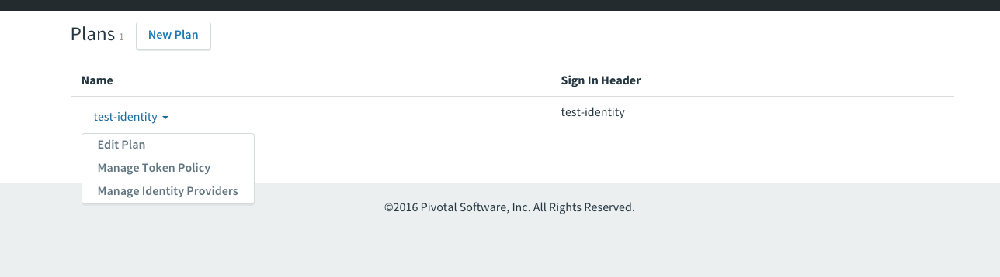
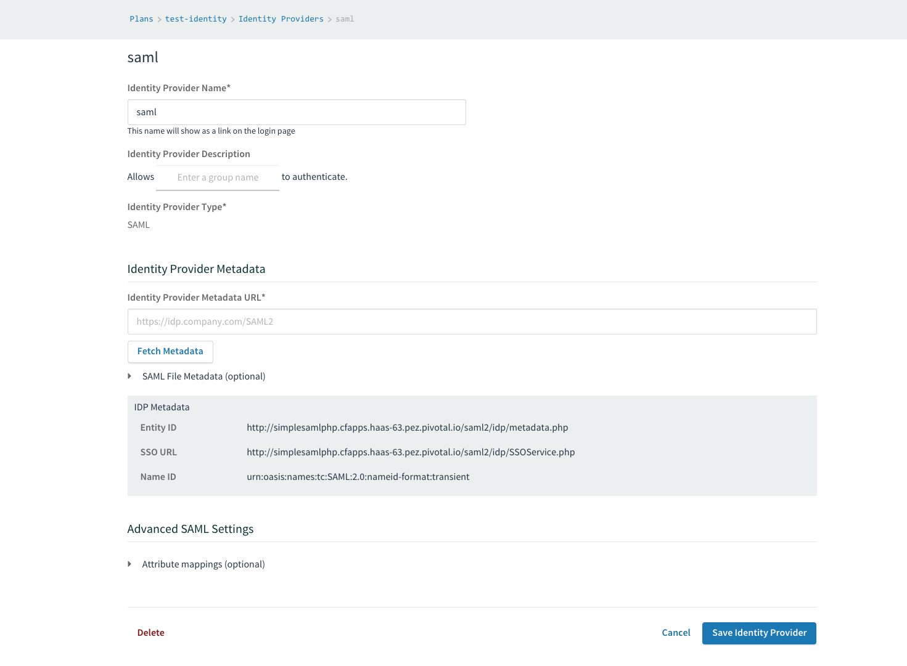
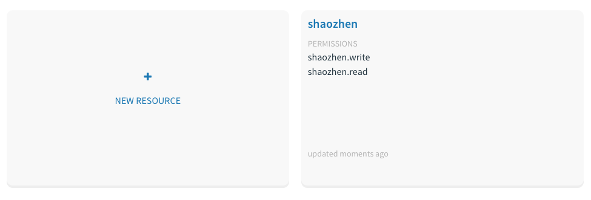
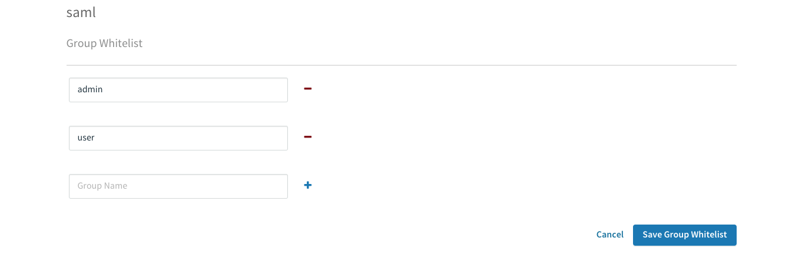
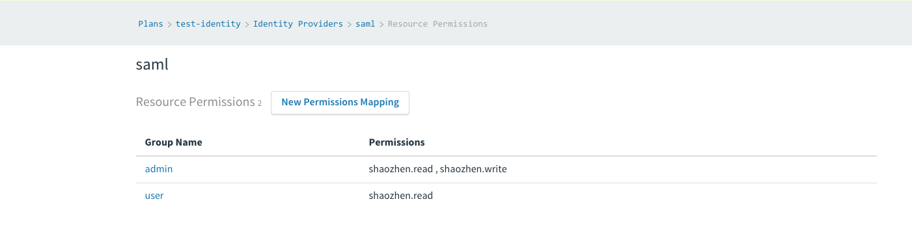
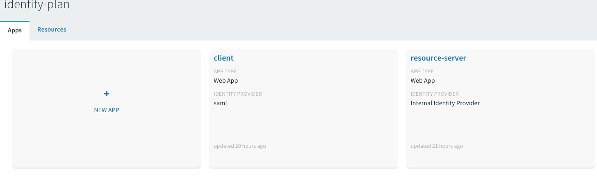
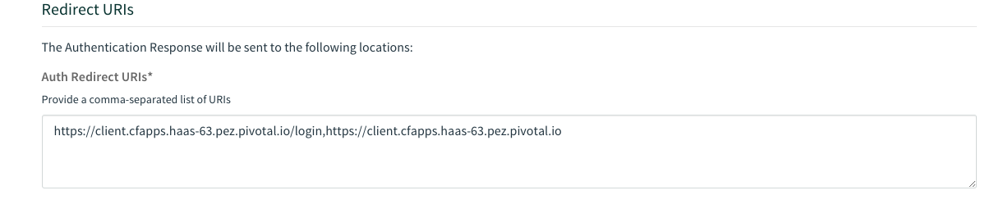
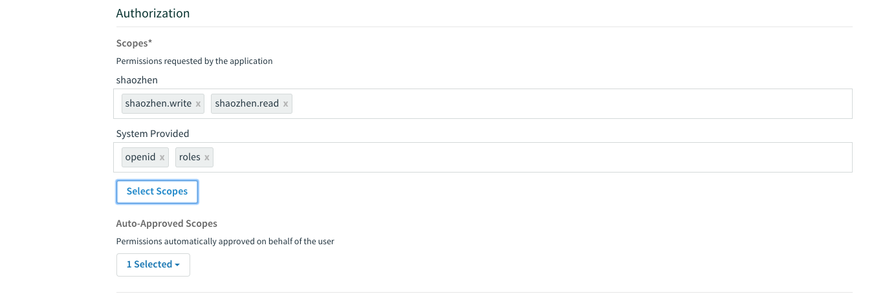
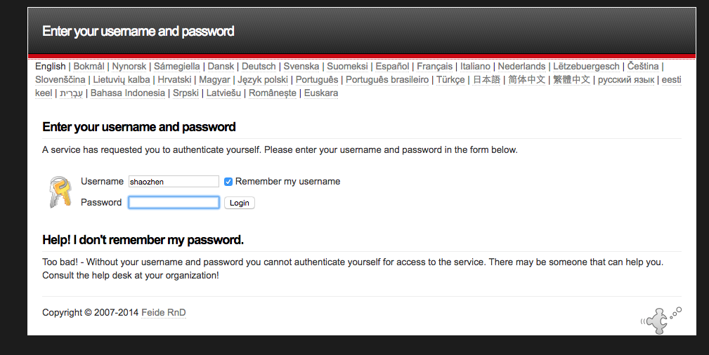

# Pivotal Single Sign on Example

## Goals
1. Understand How to configure Pivotal Single Sign On
2. Learn How to integrate single sign on with other SAML Providers
3. Learn how to code resource-server and client with spring boot

## Prerequisites

1. Pivotal Cloud Foundry installed
2. Pivotal Cloud Foundry Single Sign on tile installed
3. A SAML provider with two users belongs to two groups, admin and user.
   You can use this php saml provider for testing/experimental purpose
  https://github.com/datianshi/simplesamlphp-for-cf

  ```
  git clone https://github.com/datianshi/simplesamlphp-for-cf
  cf push
  ```
  User shaozhen (password: shaozhen) belongs to the admin group

  User marissa6 (password: saml6) belongs to the user group

  A sample SAML response

  ```
  <saml:AttributeStatement>
    <saml:Attribute Name="uid" NameFormat="urn:oasis:names:tc:SAML:2.0:attrname-format:basic">
        <saml:AttributeValue xsi:type="xs:string">shaozhen</saml:AttributeValue>
    </saml:Attribute>
    <saml:Attribute Name="eduPersonAffiliation" NameFormat="urn:oasis:names:tc:SAML:2.0:attrname-format:basic">
        <saml:AttributeValue xsi:type="xs:string">member</saml:AttributeValue>
    </saml:Attribute>
    <saml:Attribute Name="emailAddress" NameFormat="urn:oasis:names:tc:SAML:2.0:attrname-format:basic">
        <saml:AttributeValue xsi:type="xs:string">dsz0111@gmail.com</saml:AttributeValue>
    </saml:Attribute>
    <saml:Attribute Name="groups" NameFormat="urn:oasis:names:tc:SAML:2.0:attrname-format:basic">
        <saml:AttributeValue xsi:type="xs:string">saml.user</saml:AttributeValue>
        <saml:AttributeValue xsi:type="xs:string">saml.admin</saml:AttributeValue>
        <saml:AttributeValue xsi:type="xs:string">admin</saml:AttributeValue>
    </saml:Attribute>
    <saml:Attribute Name="costCenter" NameFormat="urn:oasis:names:tc:SAML:2.0:attrname-format:basic">
        <saml:AttributeValue xsi:type="xs:string">Denver,CO</saml:AttributeValue>
    </saml:Attribute>
    <saml:Attribute Name="manager" NameFormat="urn:oasis:names:tc:SAML:2.0:attrname-format:basic">
        <saml:AttributeValue xsi:type="xs:string">John the Sloth</saml:AttributeValue>
        <saml:AttributeValue xsi:type="xs:string">Kari the Ant Eater</saml:AttributeValue>
    </saml:Attribute>
</saml:AttributeStatement>
  ```

## Create and configure the Plan

* Login to p-identity.system_domain
* Click on new plan and create the plan
* Click on manage identity providers

* Click on New Identity Provider
* Input the IDP Provider SAML metadata file here.

* Configure the group attributes. E.g. the simple php saml is returning as 'groups' attribute


## Create and configure the service

* Login to the apps manager, the single sign on plan created above should show up in the market place
* Create a service (identity-plan) based on the above plan
* Click on manage service link on apps-manager that links to the service dashboard
* Create a resource named as shaozhen with two scopes as shaozhen.read and shaozhen.write


## Map the SAML group to the logical scopes.

Now we have shaozhen.read/write scopes that could be used by applications for authorization. However, How do we know a particular user authenticated by a SAML provider have those scopes. We have to map the SAML user group to the scopes

* Back to p-identity.system_domain and click on Group White list
  

  

  White list Admin and User from the identity provider

* Click on the resource permissions -> Map the IDP group to the authorization server scopes

ADMIN  -> shaozhen.read and shaozhen.write
USER -> shaozhen.read only

## Push Applications and Bind identity service

```
mvn package
cf push
```

The command will push two applications -> resource server and client.

The two applications will bind to the identity service. Underneath the binding:

* Two oauth2 clients (client id, client credentials) creation and registered to the identity service

* The clients metadata is injected to application through environment variables

* [Spring SSO Connector](https://github.com/pivotal-cf/spring-cloud-sso-connector) will read that environment variable and bootstrap the Oauth2RestTemplate

## Configure the client

Once push, the clients are created. Click on manage the identity service on apps manager. The dashboard shows two created clients



* Click on the client
* Configure Identity Provider
  In this case, disable the internal user store and enable the SAML provider created above

  

* Configure the allowed redirect URL

  Once authentication finished, what redirect URL is allowed. Since we are using spring security default /login endpoint. We need to add ${APP_URL}/login URL
  

* Configure the scopes

  Add the shaozhen.read, shaozhen.write and roles scope

  

## Application Components

### [Resource Server](resource-server)

> Resource server is an application. It guards certain resources through checking token validity against SSO Service

>The resource in this example is simply a hash map with both get and put exposing through resource server.

```
curl localhost:8081/cache/Address
Returned: Dallas

curl -X PUT localhost:8081/cache/Address?value=Austin
Changed hash map with key: Address to Austin
```

* How does the resource server guards the resource?

  > when the requests come:

  > Check the http header with token

  > Valid the token against uaa server's check_token endpoint.

  > Token with shaozhen.read scope can read the hash map through API

  > Token with shaozhen.write can write the hash map through API

  4. Code snippet

  ResourceServerApplication.java

  ```
@Configuration
@EnableAutoConfiguration
@ComponentScan
@EnableResourceServer
@EnableGlobalMethodSecurity(prePostEnabled = true, proxyTargetClass = true)
public class ResourceServerApplication
  ```

  InMemoryController.java

  ```
  @PreAuthorize("#oauth2.hasScope('shaozhen.read')")
    public String getValue(@PathVariable String key){
        return cache.getValue(key);
    }

  @PreAuthorize("#oauth2.hasScope('shaozhen.write')")
      public String putValue(@PathVariable String key, @RequestParam("value") String value){
          return cache.putValue(key, value);
      }    
  ```


### [Client](client)

> Client is an application, which needs to access the resource server on behalf of the users.

> This example consumes the resource server's rest API and has a view page to show the address and edit page to edit the address.


* How does client retrieve the token: [authorization_code](https://tools.ietf.org/html/rfc6749#page-8)

  Authorization code flow
  > User opens the browser @ APP_URL/view
  >
  > Client APP sees no token association with cookie; It redirects browser to uaa oauth/authorize endpoint with client_id, redirect_uri ... and so on.  
  >
  > UAA sees user not login yet, continue redirects the browser to the IDP Login page
  
  >
  > User enter username and password (Note: This is on IDP. Not on client application.). Then IDP redirect the page back to SSO oauth/authorize and render the authorize page (Still on SSO service)
  
  >
  > User selects the scopes and press authorize button
  >
  > The UAA redirect the page back to client with a code parameter: ${APP_URL}/view?code=rVnU7n  
  >
  > The client parses the code and use the code to post to uaa oauth/token endpoint and get UAA token in response. The token will be used by subsequent requests to resource server.

  3. Relevant Code snippet

  ClientApplication.java
  ```
  @EnableOAuth2SSO
  @Configuration
  public class ClientApplication extends WebSecurityConfigurerAdapter {  
  ```

  ResourceController.java
  ```
  @PostConstruct
 public void init() {
     oauth2RestTemplate = new OAuth2RestTemplate(address(), clientContext);
 }

 @Bean
 public OAuth2ProtectedResourceDetails address(){
     return new AuthorizationCodeResourceDetails();
 }
  ```
