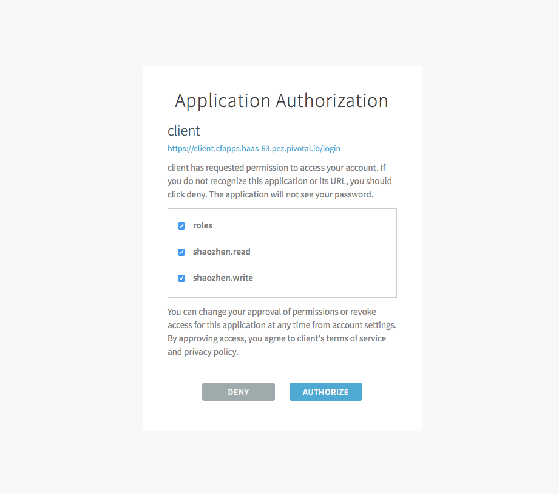

# UAA Application Example

## Goals
1. Understand Cloudfoundry UAA
2. Learn how to code resource-server and client with spring boot

## Pre reading that helps
1. [UAA Docs](https://github.com/cloudfoundry/uaa/blob/master/docs/Sysadmin-Guide.rst)

2. [Spring OAuth 2.0](http://projects.spring.io/spring-security-oauth/docs/Home.html)

3. [UAAC](https://docs.cloudfoundry.org/adminguide/uaa-user-management.html)

## Application Components

### [Resource Server](resource-server)

> Resource server is an application. It guards certain resources through checking token validity against UAA

>The resource in this example is simply a hash map with both get and put exposing through resource server.

```
curl localhost:8081/cache/Address
Returned: Dallas

curl -X PUT localhost:8081/cache/Address?value=Austin
Changed hash map with key: Address to Austin
```

* How does the resource server guards the resource?

  1. It needs to register as a UAA client with uaa.resource authority. We name the resource as shaozhen

  ```
  sding$ uaac client get shaozhen
  scope: none
  client_id: shaozhen
  resource_ids: none
  authorized_grant_types: authorization_code password refresh_token
  autoapprove:
  action: none
  authorities:  uaa.resource
  lastmodified: 1443016696873
  ```
  2. Create two groups as "shaozhen.read & shaozhen.write"

  ```
  uaac group add shaozhen.read
  uaac group add shaozhen.write
  ```

  3. Resource server token validation flow

  > when the requests come:

  > Check the http header with token

  > Valid the token against uaa server's check_token endpoint.

  > Token with shaozhen.read scope can read the hash map through API

  > Token with shaozhen.write can write the hash map through API

  4. Relevant Code snippet (UaaServiceApplication.java)

  ```
  @Configuration
  @EnableResourceServer
  protected static class ResourceServer extends ResourceServerConfigurerAdapter{
      public void configure(HttpSecurity http) throws Exception {
          http
                  .authorizeRequests().antMatchers(HttpMethod.GET,"/cache/**").access("#oauth2.hasScope('shaozhen.read')")
                  .and()
                  .authorizeRequests()
                  .antMatchers(HttpMethod.PUT, "/cache/**").access("#oauth2.hasScope('shaozhen.write')")
                  .anyRequest().permitAll(); //[4]
      }

      @Override
      public void configure(ResourceServerSecurityConfigurer resources) throws Exception {
          resources.resourceId("shaozhen");
      }

      @Bean
      ResourceServerTokenServices tokenService(){
          RemoteTokenServices remoteUAA = new RemoteTokenServices();
          remoteUAA.setClientId("shaozhen");
          remoteUAA.setClientSecret("shaozhen");
          remoteUAA.setCheckTokenEndpointUrl("https://uaa.10.65.233.228.xip.io/check_token");
          return remoteUAA;
      }
  }
  ```


### [Client](client)

> Client is an application, which needs to access the resource server on behalf of the users.

> This example consumes the resource server's rest API and has a view page to show the address and edit page to edit the address.


* How does client retrieve the token: [authorization_code](https://tools.ietf.org/html/rfc6749#page-8)

  1. Register UAA with a client id

  ```
    uaac client get sample-client
    scope: shaozhen.read shaozhen.write
    client_id: sample-client
    resource_ids: none
    authorized_grant_types: authorization_code refresh_token
    autoapprove:
    action: none
    authorities: uaa.none
    lastmodified: 1442949218113  
  ```

  2. Authorization code flow
  > User opens the browser @ localhost:8080/view
  >
  > Client sees no token association with cookie; It redirects browser to uaa oauth/authorize endpoint with client_id, redirect_uri ... and so on.  
  >
  > UAA sees user not login yet, continue redirects the browser to the uaa login page
  
  >
  > User enter username and password (Note: This is on UAA. Not on client application.). Then UAA redirect the page back to oauth/authorize and render the authorize page (Still on UAA)
  
  >
  > User selects the scopes and press authorize button
  >
  > The UAA redirect the page back to client with a code parameter: localhost:8080/view?code=rVnU7n  
  >
  > The client parses the code and use the code to post to uaa oauth/token endpoint and get UAA token in response. The token will be used by subsequent requests to resource server.

  3. Relevant Code snippet (Oauth2Configuration.java)

  ```
  @EnableOAuth2Client
  @Configuration
  public class Oauth2Configuration {

      @Value("${oauth.resource}")
      private String baseUrl;

      @Value("${oauth.authorize}")
      private String authorizeUrl;

      @Value("${oauth.token}")
      private String tokenUrl;


      @Bean
      public OAuth2RestOperations restTemplate(OAuth2ClientContext oauth2ClientContext) {
          return new OAuth2RestTemplate(resource(), oauth2ClientContext);
      }

      @Bean
      protected OAuth2ProtectedResourceDetails resource() {
          AuthorizationCodeResourceDetails resource = new AuthorizationCodeResourceDetails();
          resource.setAccessTokenUri(tokenUrl);
          resource.setUserAuthorizationUri(authorizeUrl);
          resource.setClientId("sample-client");
          resource.setClientSecret("client");
          return resource ;
      }
  }  
  ```

## User
* Create a user by using uaac  

```
uaac user add test-user --emails "sding@pivotal.io" --password test-user
uaac member add shaozhen.read test-user
uaac member add shaozhen.write test-user
```
